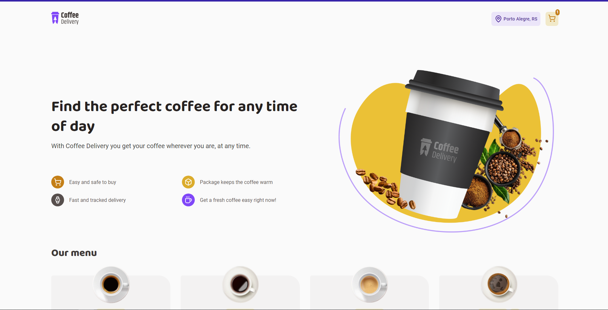

# Coffee Delivery - Front End

In this repository you can acess the frontend code of the Coffee Delivery project. It's a React project that consists in a platform where you can list a menu of coffee so that the users can buy and receive them. Feel free to use this project for your own purposes.

## ✨ Design Layout

You can access the layout preview clicking [here](https://www.figma.com/file/5yT9ZzZmRQRS4yivGGB3pl/Coffee-Delivery/duplicate).

## Preview



## 🚀 How can I set up the frontend?

First of all, clone the project in your computer.

```bash
  git clone git@github.com:gustavogarciac/coffee-delivery.git
```

---

### 💫 Running the frontend

```bash
  // Install necessary dependencies
  $ npm install

  //Run the server
  $ npm run dev

  // The terminal will show you the write url to acess the server, otherwise you can acess
  // http://localhost:5173/

```

## 🚀 Technologies

- ReactJS
- TypeScript
- Vite
- Styled Components
- React Hook Form
- React Router Dom
- Zod

## 💻 Copywright

Feel free to use this material to your own projects. Keep studying, we can change the world!
